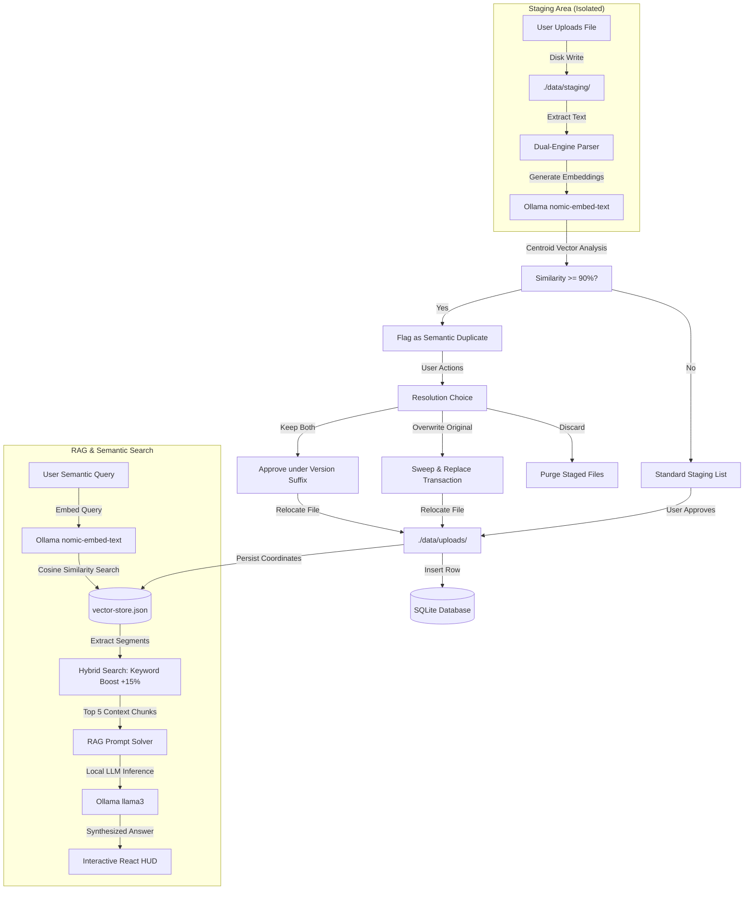

# 🛡️ Aegis SmartDrive: Offline Local AI Staging & Semantic Drive

Aegis SmartDrive is a highly secure, privacy-first, intelligent staging and semantic storage drive. It operates **100% offline and locally**, guaranteeing zero data leakage by utilizing local Large Language Models (LLMs) and vector embedding models running directly on your computer's **NVIDIA GeForce RTX 4050 GPU** via Ollama. 

Whether processing confidential invoices, research papers, or personal logs, Aegis ensures that your files never touch any third-party paid cloud APIs.

---

## 📐 System Architecture & Workflow

Aegis SmartDrive combines a Node.js/Express backend, a SQLite metadata database, a native high-speed vector index, and a modern React + Tailwind CSS v4 dashboard.



---

## ✨ Premium AI & Database Features

### 🔄 1. Semantic Duplicate Detection & Smart Versioning
Unlike basic drives that only check filenames, Aegis processes the conceptual meaning of your files:
*   **Average Centroid Vectors**: Aegis sums the 768-dimension vectors of all a document's sliding-window chunks and divides by the segment count. This represents the absolute semantic "centroid" of the entire document.
*   **Cosine Similarity Threshold**: When a new file is uploaded to staging, its centroid is compared against all previously approved files. If a match score is $\ge 0.90$ (90% similarity), the system flags the file.
*   **Conflict Resolution Engine**:
    *   **Keep Both (Version)**: Approves the staged file by appending a clean version suffix (e.g. `_v2`) to prevent name collisions.
    *   **Overwrite Original**: Runs an atomic sweeping transaction that deletes the old binary from your hard drive, purges the old vector coordinates from your database index, and relocates the new file cleanly in its place.
    *   **Discard / Skip**: Standard skip action that cleans up staging.

### 🧠 2. Hybrid Search Engine & Reranking
To guarantee the highest quality of local retrieval, Aegis implements a hybrid ranking pipeline:
*   **Semantic Matching**: Calculates the cosine similarity of the query vector against all 600-word document chunks.
*   **+15% Exact-Keyword Boost**: Scans the text segments for rare terms (e.g., `"HSN"`, `"IGST"`, specific invoice numbers). If an exact query word is found in a chunk, its search confidence score receives a **+15% boost**, placing critical data at the top of the search index automatically.

### ⚡ 3. Real-Time Hardware GPU HUD Popup
AI inference puts your GPU to work. Aegis features a beautiful, glassmorphic diagnostic dashboard popup that monitors:
*   **NVIDIA GeForce RTX 4050 GPU Core** statistics.
*   **VRAM Allocation** (monitors how much of the 6.0GB VRAM is occupied by Ollama models).
*   **Thermals & CUDA/Tensor loads**.
*   **Elapsed Stopwatch Timer**: Shows you exactly how long the background embeddings generation and LLM text synthesis took down to the millisecond.

### 🛡️ 4. Self-Healing Startup Vector Re-Indexer
If the server crashes or starts up after the JSON vector database (`vector-store.json`) is wiped, Aegis checks SQLite against your approved files on disk. If any active files are missing their corresponding vector coordinates, Aegis automatically kicks off a **background self-healing re-indexer** on boot. This ensures your semantic index stays completely synchronized without requiring manual uploads.

### 🔌 5. Resilient Local Ollama Failsafe
If the local Ollama daemon is closed or hasn't finished loading, Aegis remains fully operational:
*   Instead of crashing, the search controller catches connection failures and gracefully falls back to an **exact-match SQLite text search**.
*   The UI displays a clean visual **"Offline Keyword Search Fallback"** indicator, keeping the application robust and reliable under all desktop environments.

---

## 🛠️ Technology Stack

*   **Backend**: Node.js + Express (Modern ES modules, `"type": "module"`)
*   **Frontend**: React (v19) + Vite + Tailwind CSS (v4) + Lucide Icons
*   **Database**: SQLite (`sqlite3` & `sqlite`) for relational metadata and stage logs
*   **Vector Engine**: Custom abstract vector store interface (`LocalVectorStore`) persisting to `backend/data/vector-store.json`. Designed to easily transition to ChromaDB or LanceDB later.
*   **AI Engine**: Official Ollama JS SDK

---

## 📂 Project Directory Structure

```
smart-drive/
├── backend/
│   ├── server.js              # Express app bootstrap, SQLite migrations, & self-healing trigger
│   ├── .env                   # Environment ports, paths, and local AI model names
│   ├── config/
│   │   ├── db.js              # SQLite database configuration & column migrations
│   │   └── ollama.js          # Ollama SDK connection checks & model tag verifications
│   ├── controllers/
│   │   ├── fileController.js  # Multer stager, duplicate calculations, & overwrite actions
│   │   ├── searchController.js# Hybrid search rerankers, SQLite fallbacks & Llama 3 RAG prompt
│   │   └── folderController.js# Dynamic grouping and navigation endpoints
│   ├── routes/
│   │   ├── files.js           # Multer uploads & approved move paths
│   │   ├── search.js          # Hybrid search API routes
│   │   └── folders.js         # Folder categories API routes
│   ├── services/
│   │   ├── aiService.js       # Auto-classification and metadata tagging
│   │   ├── embeddingService.js# sliding vector windowing, centroids, & re-indexing workers
│   │   ├── parserService.js   # PDF-parse, Mammoth DOCX, Plain-text, & Tesseract/Llama OCR
│   │   └── storageService.js  # Atomic staging and physical disk operations
│   └── data/                  # 🔒 (Git Ignored) Holds smart-drive.db and vector-store.json
├── frontend/
│   ├── package.json           # React, Tailwind v4, and Vite dependencies
│   ├── vite.config.js         # Vite bundler configuration with @tailwindcss/vite plugin
│   └── src/
│       ├── main.jsx           # App mounting loader
│       ├── App.jsx            # Sleek glassmorphic workspace, staging cards, and GPU HUD
│       └── index.css          # Tailwind imports, modern Outfit/Inter typography, & animations
└── .gitignore                 # Shields local uploads, private databases, logs, and keys
```

---

## 🚀 Step-by-Step Installation Guide

### Prerequisites
1.  **Node.js** (v18 or higher) installed on your system.
2.  **Ollama** desktop client installed and running.
3.  Open a terminal and pull the two required models:
    ```bash
    ollama pull llama3
    ollama pull nomic-embed-text
    ```

### 1. Set Up the Backend
1.  Navigate into the `backend` folder:
    ```bash
    cd backend
    ```
2.  Install dependencies:
    ```bash
    npm install
    ```
3.  Create/verify the `.env` file (A template is already provided for you):
    ```env
    PORT=5000
    OLLAMA_HOST=http://localhost:11434
    OLLAMA_LLM_MODEL=llama3
    OLLAMA_EMBED_MODEL=nomic-embed-text
    UPLOAD_DIR=./data/uploads
    STAGE_DIR=./data/staging
    DATABASE_FILE=./data/smart-drive.db
    ```
4.  Launch the backend server:
    ```bash
    npm start
    ```
    *The server will boot on **http://localhost:5000**, initialize the SQLite schema, verify your Ollama status, and automatically scan for any unindexed files.*

### 2. Set Up the Frontend
1.  Open a new terminal window at the root of the project and navigate to `frontend`:
    ```bash
    cd frontend
    ```
2.  Install dependencies:
    ```bash
    npm install
    ```
3.  Run the Vite development server:
    ```bash
    npm run dev
    ```
4.  Open your browser and navigate to **http://localhost:5173** to experience the Aegis SmartDrive dashboard.

---

## 📦 How to Push this Project to GitHub (Manual Terminal Commands)

If you are ready to back up your Aegis SmartDrive project to a GitHub repository, open a terminal at the **root of the `smart-drive` directory** and run the following commands sequentially:

1.  **Initialize Git Repository** (if not already done):
    ```bash
    git init
    ```
2.  **Check Untracked Files**:
    ```bash
    git status
    ```
    *Verify that large folders like `node_modules`, `backend/data`, and `.env` files are faded or excluded (protected by the `.gitignore`).*
3.  **Add Files to Staging**:
    ```bash
    git add .
    ```
4.  **Create Your Initial Commit**:
    ```bash
    git commit -m "feat: implement local AI semantic drive with RTX GPU diagnostics HUD and semantic duplicate detection"
    ```
5.  **Create a New Repository on GitHub**:
    * Go to [github.com/new](https://github.com/new).
    * Create a new repository (do **not** check "Add a README", "Add .gitignore", or "Choose a license" since they already exist in your local code).
6.  **Link and Push to GitHub** (Replace `your-username` and `your-repo-name` with your actual GitHub details):
    ```bash
    git branch -M main
    git remote add origin https://github.com/your-username/your-repo-name.git
    git push -u origin main
    ```

---

## 🔧 Troubleshooting Guide

### ❌ Server displays "Ollama Connection Failed" on boot
*   **Cause**: The Ollama desktop application is not open, or is starting up.
*   **Fix**: Verify Ollama is running in your Windows System Tray (near the clock). You can test if Ollama is responsive by running `curl http://localhost:11434` in your terminal. Aegis will gracefully fall back to SQLite keyword search if Ollama is not active.

### ❌ Staged PDF/Word files show zero classification tags
*   **Cause**: The local model `llama3` is busy or hasn't been pulled.
*   **Fix**: Run `ollama list` in your command line to ensure both `llama3` and `nomic-embed-text` are successfully downloaded. If one is missing, run `ollama pull <model-name>`.

### ❌ Database is locked or needs a fresh reset
*   **Cause**: Concurrent file locks from unexpected shutdowns.
*   **Fix**: Stop the backend server, navigate to `backend/data/`, and delete `smart-drive.db`. When you restart the backend via `npm start`, the server will automatically regenerate a fresh SQLite file structure, recreate all tables, and rebuild embeddings using the self-healing startup indexer.

---

## 🔒 Security, Compliance, & Privacy Guarantee
Aegis SmartDrive runs 100% locally. No document text, image buffers, database files, or query histories are ever transmitted outside your machine. All OCR calculation cycles, LLM token generations, and mathematical cosine scores remain entirely inside your offline sandboxed local environment.
